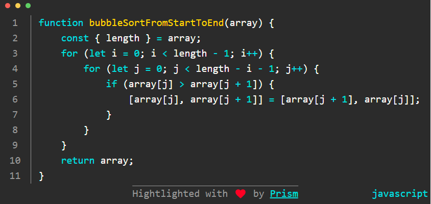

# Vue3-Prism

This is a project for displaying more beautiful and elegant code block in website based in [Vue 3](https://vuejs.org/) and [Prism.js](https://prismjs.com/).



## Clone Project

```
git clone https://github.com/321paranoiawhy/Vue3-Prism
```

## Compiles and hot-reloads for development

```bash
# alias
npm run s # npm run service
```

## Compiles and minifies for production

```bash
# alias
npm run b # npm run build
```

## Build a single entry as a library

```bash
npm run lib
```

Reference:

* [Vue Cli - Build Targets-Library](https://cli.vuejs.org/guide/build-targets.html#library)

## Examples

* [Replit](https://replit.com/@321paranoiawhy/Vue3-Prism#src/main.js)
* [Code sandbox](https://codesandbox.io/s/vue3-prism-ltr01o?file=/src/main.js)


# Usage

## Install

[npm - vue3-prism](https://www.npmjs.com/package/vue3-prism)

```
npm i vue3-prism
```

## Global Registration

In `main.js`:

```javascript
// main.js
import { createApp } from 'vue'
import App from './App.vue'
import router from './router'
import store from './store'

import Vue3Prism from 'vue3-prism/lib/Vue3Prism.common.js'
import "vue3-prism/lib/Vue3Prism.css"

createApp(App).use(store).use(router).use(Vue3Prism).mount('#app')
```

As long as you have registered globally, then you can use `Vue3Prism` anywhere you want. It may just like this:

```vue
<!-- HelloWorld.vue -->
<template>
<!-- just pass source code in -->
    <Vue3Prism
        source="function bubbleSortFromStartToEnd(array) {
    const { length } = array;
    for (let i = 0; i < length - 1; i++) {
        for (let j = 0; j < length - i - 1; j++) {
            if (array[j] > array[j + 1]) {
                [array[j], array[j + 1]] = [array[j + 1], array[j]];
            }
        }
    }
    return array;
}"
    ></Vue3Prism>
</template>

<script>
export default {
    name: "HelloWorld",
};
</script>
```

Reference:

* [Vue.js - Global Registration](https://vuejs.org/guide/components/registration.html#global-registration)
* [MDN - Namespace import](https://developer.mozilla.org/en-US/docs/Web/JavaScript/Reference/Statements/import#namespace_import)

## Local Registration

To be continued...

Reference:
* [Vue.js - Local Registration](https://vuejs.org/guide/components/registration.html#local-registration)